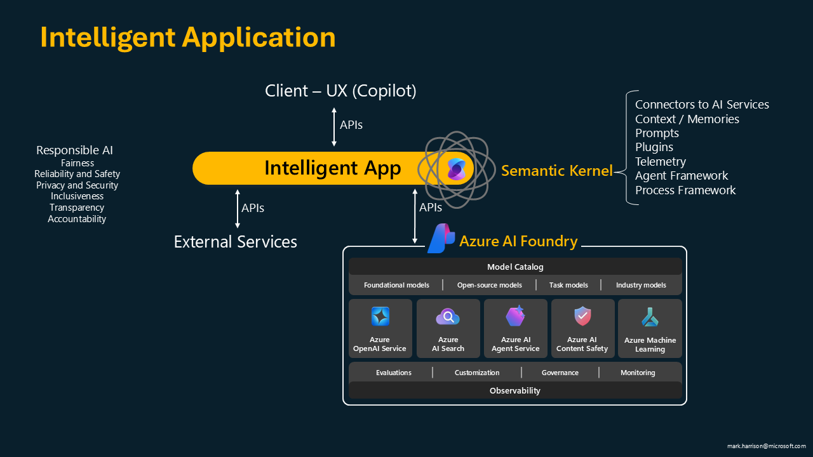
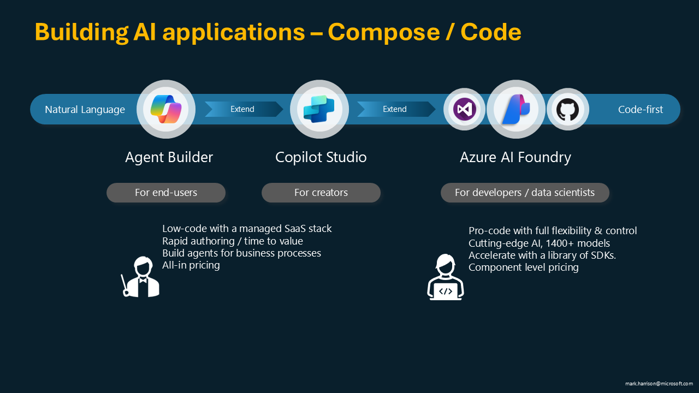

# Semantic Kernel

## Semantic Kernel Functionality 

Returning to the high-level architecture of intelligent apps, various software libraries are available for building AI applications. Microsoft's solution is the Semantic Kernel, an open-source, lightweight, and extensible framework that reduces the amount of code developers need to write. It is fully supported by Microsoft, so if users encounter issues, they can reach out for assistance. 

Semantic Kernel supports multiple languages, including Python, Java, and .NET. 

It provides Connectors to AI services. For instance, if an application uses OpenAI today but needs to switch to another model later, developers can simply change the connector without modifying the entire application.  Additional features include memory and context handling, prompt management, and plugins for integrating with external APIs like weather services or Bing Search. Telemetry features help with app observability.

Semantic Kernel also has two sub-frameworks: the Agent Framework, which handles interactions between multiple agents, and the Process Framework, which supports event-driven process management.

## AutoGen

An alternative to Semantic Kernel is AutoGen. The key difference is that Semantic Kernel is fully supported and recommended for enterprise applications, with stability and no breaking changes. AutoGen, on the other hand, is a Microsoft Research project designed for experimentation and ideation at the cutting edge of AI development. For enterprise-grade applications, Microsoft advises using Semantic Kernel.

## Azure AI Foundry 

Looking at AI application architecture, Microsoft offers Azure AI Foundry, a complete AI toolchain that brings together all necessary services within a single platform. It includes various AI models, customization options for applications and agents, and the new Azure AI Agent Service, which simplifies the process of deploying AI applications into production.

## Copilot Studio  

Microsoft provides a spectrum of tools for building AI applications. In addition to AI Foundry, there are also no-code and low-code tools available to help users create applications more easily. 

Agent Builder / Copilot Studio consists of software-as-a-service (SaaS) solutions, while AI Foundry is for full-code development without limitations. 

It’s important to note that Copilot Studio and AI Foundry are not competing solutions but complementary, offering significant interoperability.

